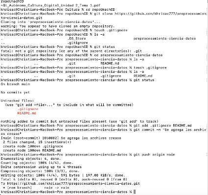
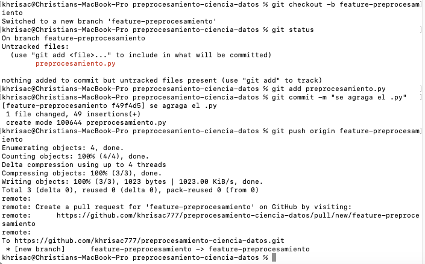

UNACH Ciencia de DAtos 
# Actividad Autonima 3 
Herramientas y Metodologías en Ciencia de Datos
Chrsitian Andres Carchi
A continuación se describen los comandos clave utilizados:
* `git clone https://github.com/khrisac777/preprocesamiento-ciencia-datos.git`: Para descargar el repositorio remoto de GitHub a la máquina local.
touch .gitignore; para agregar el archivo .gitignore
`git status`: para ve el estado de las carpeta
`git config --global Khrisac777 `: Para configurar la identidad del usuario que realiza los commits.
`git add [archivo]`: Para añadir archivos al "Staging Area", preparándolos para el próximo commit.
`git commit -m "Describimos el cambio"`: Para guardar una instantánea de los cambios en el historial local del repositorio.
`git push origin [rama]`: Para subir los commits locales a la rama especificada en el repositorio remoto (GitHub)[cite: 69].
`git checkout -b [feature-preprocesamiento]`: Para crear una nueva rama y cambiarse a ella en un solo paso.
`git checkout [rama]`: Para moverse entre ramas existentes.
`git pull origin [rama]`: Para descargar y fusionar los cambios más recientes desde el repositorio remoto a la rama local.
`git branch -d [rama]`: Para eliminar una rama local que ya no se necesita.

## 3. Automatización con GitHub Actions
Aunque esta actividad no implementó un workflow, GitHub Actions es una herramienta de CI/CD (Integración y Entrega Continua) integrada en GitHub.

En un proyecto de Ciencia de Datos, se podría usar para:
**Ejecutar Pruebas (CI):** Cada vez que se abre un Pull Request, Actions puede ejecutar automáticamente el script de Python (como se ve en el Video 2) para asegurar que los cambios no rompan el código existente[cite: 1202].
**Validar Calidad del Código:** Ejecutar herramientas como *linters* (Flake8) o *formatters* (Black) para mantener un estilo de código consistente.
**Entrenamiento de Modelos (CD):** En flujos más avanzados, un merge a `main` podría disparar un *workflow* que re-entrene un modelo de Machine Learning y lo despliegue.

## 4. Evidencia y Capturas de Pantalla [cite: 83]
**Commit Inicial y Push a `main`**

**Captura 2: Push de la Rama `feature-preprocesamiento`**

**Captura 3: Pull Request Fusionado en GitHub**

